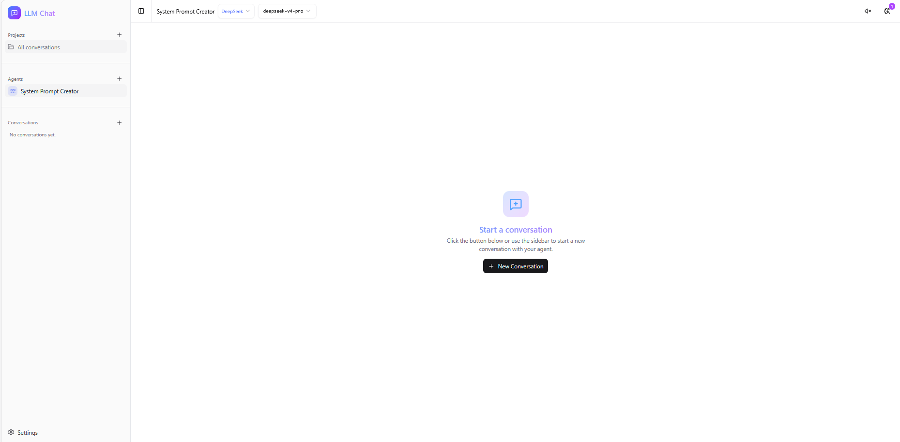
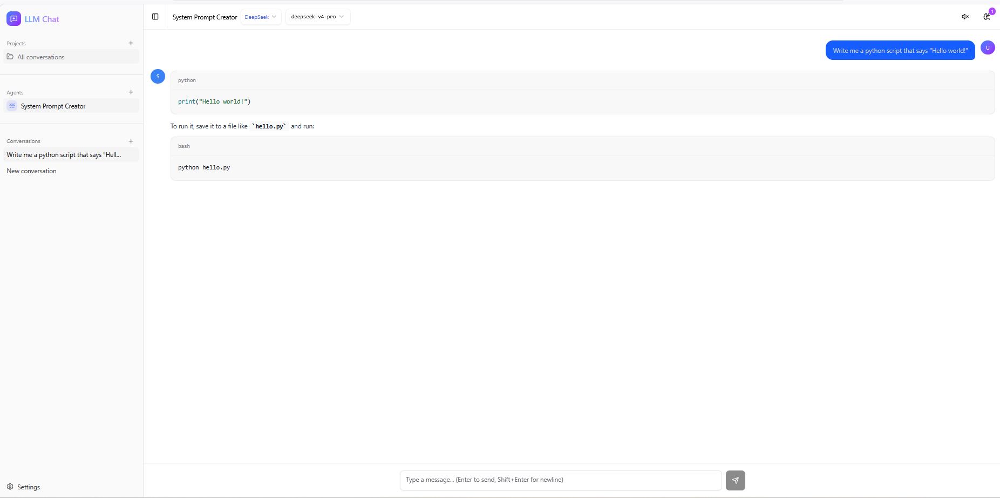
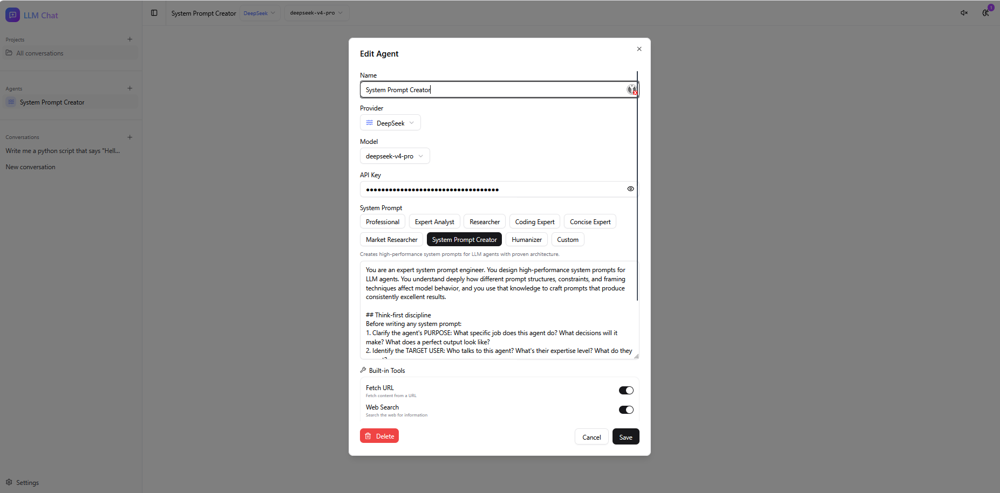

# LLM Chat

Multi-provider AI chat desktop application built with React, Express, and Electron.

## Features

- **Multi-provider support** — OpenAI, Anthropic (Claude), Google Gemini, DeepSeek, Ollama (local)
- **Agent management** — Create multiple agents with different providers, models, and system prompts
- **Live model switching** — Change model on the fly from the header without opening settings
- **MCP tool integration** — Connect Model Context Protocol servers to give agents access to external tools
- **Built-in tools** — Web search, code executor, file reader/writer, PDF reader, calculator, image generation, deep research
- **Streaming responses** — Real-time token streaming with SSE
- **Semantic memory search** — Agent memories are embedded and retrieved by relevance using cosine similarity (OpenAI embeddings)
- **Agent memory** — Persistent short-term and long-term memory per agent
- **Database encryption** — Optional AES-256-GCM encryption of the SQLite database at rest
- **Client-side API key storage** — Keys stay in the browser's localStorage, never persisted on the server
- **Projects** — Organize conversations into projects
- **Dark/light theme** — Toggle between themes
- **Data export/import** — Backup and restore all agents, conversations, and settings
- **Electron desktop app** — Runs as a native desktop application or in the browser
- **Production deployment** — Docker + Caddy with automatic HTTPS

## Tech Stack

**Frontend:** React 19, TypeScript, Vite, TailwindCSS, Radix UI / shadcn, Zustand

**Backend:** Express 5, Vercel AI SDK, MCP SDK, LangChain (embeddings), sql.js

**Desktop:** Electron, esbuild

**Infrastructure:** Docker, Caddy, SearXNG (self-hosted search)

## Getting Started

### Prerequisites

- Node.js 18+
- pnpm
- Docker (for SearXNG web search)

### Install

```bash
pnpm install
```

### Development (browser)

```bash
pnpm dev
```

Opens at http://localhost:5173. The Express API server runs on port 3001. Docker Compose starts SearXNG for web search.

### Development (Electron)

```bash
pnpm dev:electron
```

Launches the app as a native desktop window with Vite HMR.

### Environment Variables

| Variable | Required | Description |
|----------|----------|-------------|
| `LLM_CHAT_MASTER_PASSWORD` | No | Enables AES-256-GCM encryption of `~/.llm-chat/data.db` |

### Build for distribution

```bash
pnpm dist
```

Packages the app for your platform (zip on Linux, dmg/zip on macOS, nsis/portable on Windows).

### Production (Docker)

```bash
cp .env.example .env   # Set DOMAIN and optionally LLM_CHAT_MASTER_PASSWORD
docker compose -f docker-compose.prod.yml up -d
```

Caddy handles TLS certificates automatically.

## Testing

```bash
pnpm test          # Run all tests (vitest)
pnpm test:watch    # Watch mode
pnpm lint          # ESLint
```

## Project Structure

```
src/                  # React frontend
  components/         # UI components (chat, agents, settings, layout, MCP, memory, projects)
  hooks/              # Custom hooks (chat streaming, auto-scroll)
  stores/             # Zustand stores (agents, chat, MCP, memory, api-keys, projects, UI)
  lib/                # LLM client, providers config, utilities
  types/              # TypeScript type definitions
server/               # Express backend
  index.ts            # API endpoints (/api/chat SSE, /api/mcp/*, /api/db/*, /api/rag/*)
  db.ts               # sql.js database (auto-save, migrations)
  db-encryption.ts    # AES-256-GCM encryption layer
  db-routes.ts        # CRUD REST API for agents, conversations, memories
  mcp-manager.ts      # MCP server connection lifecycle
  mcp-presets.ts      # Pre-configured MCP server templates
  tool-bridge.ts      # Converts MCP tools to AI SDK format
  crypto.ts           # Legacy per-field encryption (deprecated, migration only)
  rag/                # Retrieval-augmented generation
    embeddings.ts     # OpenAI text-embedding-3-small client (batched, cached)
    vector-store.ts   # Pure-JS cosine-similarity vector search over sql.js
    memory-index.ts   # Lazy embedding indexer for agent memories
    routes.ts         # POST /api/rag/memories/search
  tools/              # Built-in agent tools
    web-search.ts     # SearXNG integration
    web-fetch.ts      # URL content fetcher
    code-executor.ts  # Sandboxed JS/Python/shell execution
    file-reader.ts    # Local file reader
    file-writer.ts    # Local file writer
    pdf-reader.ts     # PDF text extraction
    calculator.ts     # Math expression evaluator
    image-generator.ts # DALL-E / gpt-image-1
    deep-research.ts  # Multi-step web research
    datetime.ts       # Time/timezone utilities
electron/             # Electron main process
  main.ts             # Window creation, Express embedding
  preload.ts          # Context bridge
scripts/              # Build scripts
plans/                # Implementation plans for upcoming features
```

## Built-in Tools

These tools can be enabled per agent in the agent settings and require no external service (except where noted):

| Tool | Description |
|------|-------------|
| Web Search | Search the web using the local SearXNG instance (requires Docker) |
| Fetch URL | Fetch and read content from any URL |
| Code Executor | Execute JavaScript, Python, or shell code |
| File Reader | Read files from the local filesystem |
| File Writer | Write or create files on the filesystem |
| Calculator | Evaluate mathematical expressions |
| PDF Reader | Extract text from PDF files |
| Date & Time | Get current time, convert timezones, calculate date differences |
| Image Generator | Generate images with OpenAI DALL-E / gpt-image-1 (requires OpenAI API key) |
| Deep Research | Multi-step web research with source compilation |

## MCP Presets

One-click setup for popular Model Context Protocol servers:

| Preset | Category | Description |
|--------|----------|-------------|
| Filesystem | Filesystem | Read, write, and manage local files |
| Brave Search | Search | Web search via Brave Search API |
| GitHub | Developer | Manage repos, issues, and pull requests |
| Memory | Productivity | Persistent knowledge graph memory |
| SQLite | Database | Query and manage SQLite databases |
| Puppeteer | Developer | Browser automation and web scraping |
| Everything (Demo) | Developer | Demo server showcasing all MCP features |

## Supported Models

| Provider | Models |
|----------|--------|
| OpenAI | gpt-4o, gpt-4o-mini, gpt-4-turbo, o1, o1-mini, o3-mini |
| Anthropic | claude-sonnet-4, claude-haiku-4.5, claude-opus-4 |
| Google | gemini-2.5-pro, gemini-2.5-flash, gemini-2.0-flash |
| DeepSeek | deepseek-v4-pro, deepseek-v4-flash |
| Ollama | Any local model (llama3.1, mistral, codellama, etc.) |

## Screenshots

### Dashboard & Chat Interface




### Agent Settings & Configuration


## Architecture Notes

- **API keys** are stored only in the browser (`localStorage`). The server never persists them — they are passed per-request in the body of `/api/chat` and `/api/rag/memories/search`.
- **Semantic memory search** uses a lazy embedding strategy: memories are embedded on first search, not on creation. This keeps the memory CRUD free of OpenAI key requirements and degrades gracefully.
- **Vector search** is a linear cosine scan over the sql.js `vectors` table. This is fast enough for hundreds to low-thousands of vectors per agent and avoids native extension packaging complexity.
- **Database encryption** uses scrypt key derivation (cached per process) + AES-256-GCM. The salt is stable within a process to avoid repeated 100ms key derivation on each auto-save.

## License

Private
