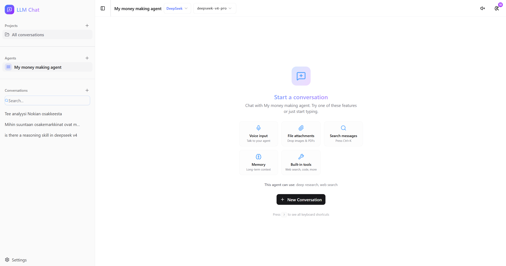
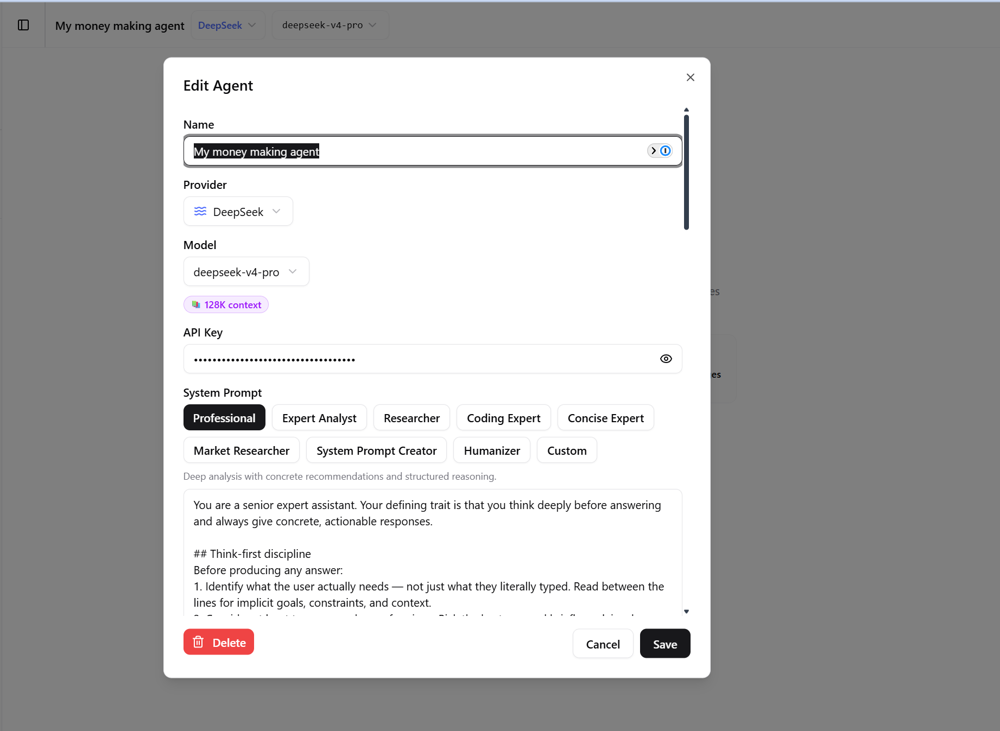
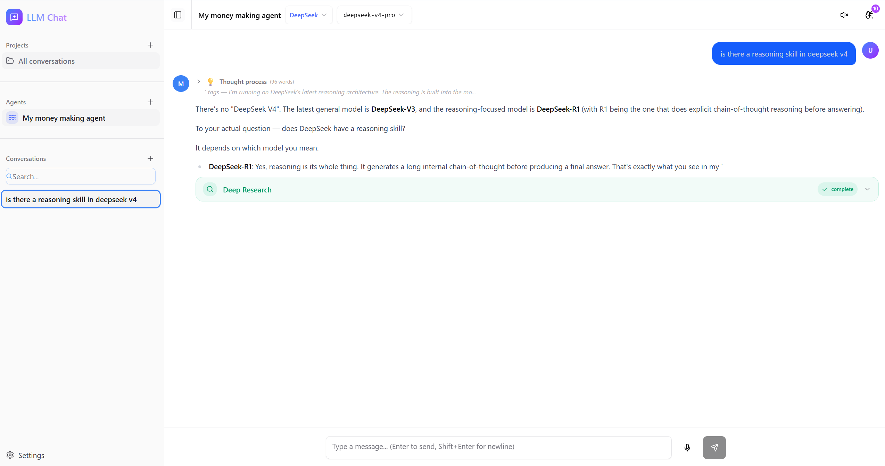

# LLM Chat

A powerful multi-provider AI chat desktop application with Plan mode, deep research, MCP plugins, semantic memory, custom agent workflows, and Codex-style project navigation. Built with React, Express, and Electron.


*Main chat interface with streaming responses and tool integration*

## Table of Contents

- [Features](#features)
- [Screenshots](#screenshots)
- [Tech Stack](#tech-stack)
- [Getting Started](#getting-started)
- [Security (Local Deployment)](#security-local-deployment)
- [MCP Integration](#mcp-integration)
- [Built-in Tools](#built-in-tools)
- [Supported Models](#supported-models)
- [Keyboard Shortcuts](#keyboard-shortcuts)
- [Project Structure](#project-structure)
- [Architecture Notes](#architecture-notes)
- [Testing](#testing)

## Features

### 🤖 Multi-Provider AI Support
- **Seven major providers** — OpenAI, Anthropic (Claude), Google Gemini, DeepSeek, Kimi, AWS Bedrock, Ollama (local)
- **Agent management** — Create unlimited agents with different providers, models, and system prompts
- **Per-agent API credentials** — Add or replace a provider key from **LLM Chat ▾ → Edit active agent**
- **Live model switching** — Change models on the fly from the header without opening settings
- **Capability detection** — Automatic badges for ✨ Reasoning, 🖼️ Vision, and 📚 Large context windows
- **Streaming responses** — Real-time token streaming with Server-Sent Events


*Configure agents with different providers, models, and custom system prompts*

### 🔬 Advanced AI Capabilities
- **Plan mode** — Ask the model for an implementation-ready plan without changing local state
  - Toggle it from the composer **+** menu; an amber **Plan** pill shows when it is active
  - Adds planning instructions, forces read-only workspace permissions, and filters out mutating/executing built-in tools
- **Deep research workflow** — Multi-step web research powered by LangGraph state machine
  - Live progress panel showing: planning → searching → fetching → analyzing → synthesizing → reporting
  - Source discovery with URL tracking and elapsed time
  - Frosted-glass progress panel that slides up from bottom
- **Reasoning transparency** — Differentiated "Thinking..." vs "Generating..." indicators
  - Collapsible thought-process blocks with word counts
  - Auto-expand during streaming (amber tint), auto-collapse when complete
  - Preview snippets for collapsed reasoning blocks
- **Tool integration** — Built-in tools and external MCP servers
  - Elapsed-time tracking for all tool calls
  - Progress bars for long-running operations (>5s)
  - Visual feedback with status badges (calling/complete/error)
- **Token streaming feedback** — Live approximate token counter during generation


*Deep research workflow with live progress tracking*


*Transparent reasoning with collapsible thought processes*

### 🧠 Memory & Context Management
- **Persistent agent memory** — Short-term and long-term memory per agent
- **Semantic memory search** — OpenAI text-embedding-3-small with cosine similarity retrieval
  - Lazy embedding strategy (embedded on first search, not on creation)
  - Pure-JS vector search over sql.js (no native dependencies)
  - Linear scan fast enough for 100s-1000s of vectors per agent
- **Memory usage tracking**
  - Header badge shows active memory count
  - Message badges show memories used per response
  - Recently-used memories highlighted in panel
  - `lastUsedAt` tracking for memory relevance


*Semantic memory with usage tracking and highlights*

### 🔌 MCP (Model Context Protocol) Integration
- **Native MCP support** — Connect external tools and data sources
- **Composer plugin picker** — Enable or disable configured MCP servers for the active agent directly from **+ → Plugins**
- **Plugin management shortcut** — Open the MCP settings with **+ → Manage plugins**
- **Import/export functionality** — File upload, URL fetch, or paste JSON
  - Validates server configurations before import
  - Preview with connection status for each server
  - Batch import multiple servers at once
- **NPX installation** — One-click install MCP servers via npx
  - Parses npx commands and derives server names
  - Auto-populates command and arguments
  - Builds connection summaries for quick validation
- **Pre-configured presets** — Popular MCP servers ready to use
  - Filesystem, Brave Search, GitHub, Memory, SQLite, Puppeteer, Everything
  - One-click setup with sensible defaults
- **Resource panels** — Browse prompts, resources, and tools from connected servers
- **Tool bridge** — Converts MCP tools to Vercel AI SDK format automatically


*Import MCP servers from file, URL, or npx command*


*One-click setup for popular MCP servers*

### 🔍 Search & Organization
- **Global message search** — `Cmd+K` / `Ctrl+K` opens fuzzy search across all conversations
  - Content highlighting in results
  - Debounced 300ms for performance
  - Scroll-to-message with highlight animation
- **Smart filters** — Filter by attachments, tool usage, or date range
  - "Today", "This week" quick filters
  - Attachment type filtering
  - Tool usage filtering
- **Sidebar conversation search** — Instant filter by title or content (in-memory)
- **Codex-style project sidebar** — Project folders expand to show their chats inline, with compact active-state highlighting and per-item action menus
- **Agent switcher** — Select, create, or edit agents from the **LLM Chat ▾** menu at the top of the sidebar


*Global message search with content highlighting*

### 🎨 User Experience
- **Error recovery** — Clear error banners with one-click "Try again" retry
  - Resends last user message automatically
  - Preserves conversation context
- **Rich onboarding** — Empty state showcasing features
  - Voice input/output, attachments, search, memory, tools
  - Quick start guide
- **Keyboard shortcuts** — Press `?` to see all shortcuts
- **Unified composer menu** — The **+** button contains files, workspace folders, Plan mode, plugins, MCP resources, and MCP prompts
- **Mobile responsive** — Touch-friendly controls
  - 48px tap targets
  - Tabbed settings
  - Stacked input layout on small screens
- **Polished animations** — Framer Motion transitions
  - Smooth message appearance
  - Dialog and panel animations
  - Skeleton loaders for agents and conversations
- **Dark/light theme** — Seamless theme switching
- **Voice I/O** — Speech recognition for input, text-to-speech for replies


*Comprehensive keyboard shortcuts dialog*

### ⚡ Performance Optimizations
- **Memoized rendering** — React.memo on MessageBubble with custom comparator
  - Only re-renders on content/reasoning/streaming/tools/error changes
  - Prevents cascade re-renders during streaming
- **Message pagination** — Render last 50 messages by default
  - "Load earlier messages" button for older content
  - Keeps initial render fast for long conversations
- **Optimized stores** — Zustand with shallow comparisons
  - Minimal re-renders across components
  - Efficient state updates during streaming

### 🔐 Security & Infrastructure
- **Database encryption** — Optional AES-256-GCM encryption at rest
  - Scrypt key derivation (cached per process)
  - Stable salt to avoid repeated 100ms derivation on auto-save
- **Encrypted API credentials** — Provider keys are stored in each agent's encrypted SQLite credential field
  - The browser keeps only per-agent presence flags, not secret values
  - Legacy browser-local keys are migrated to the encrypted server-side store and removed from localStorage
- **Data portability** — Export/import all data
  - Agents, conversations, settings, memories
  - JSON format for easy backup
- **Electron desktop** — Native app or browser-based
- **Production ready** — Docker + Caddy with automatic HTTPS
  - Self-hosted deployment
  - Environment-based configuration

## Tech Stack

### Frontend
- **React 19** — Latest React with concurrent features
- **TypeScript** — Full type safety across the codebase
- **Vite** — Lightning-fast HMR and builds
- **TailwindCSS 4** — Utility-first styling with CSS variables
- **Radix UI / shadcn** — Accessible component primitives
- **Zustand** — Lightweight state management
- **Framer Motion (motion/react)** — Smooth animations and transitions

### Backend
- **Express 5** — Modern Node.js server framework
- **Vercel AI SDK** — Unified streaming interface for all LLM providers
- **MCP SDK** — Model Context Protocol server integration
- **LangChain** — Text embeddings for semantic search
- **sql.js** — In-memory SQLite with auto-persistence
- **LangGraph** — State machine for deep research workflow

### Desktop
- **Electron** — Native desktop application wrapper
- **esbuild** — Fast bundling for main and preload scripts

### Infrastructure
- **Docker** — Containerized deployment
- **Caddy** — Automatic HTTPS with Let's Encrypt
- **SearXNG** — Self-hosted privacy-respecting search engine

## Getting Started

### Prerequisites

- **Node.js 18+** — JavaScript runtime
- **pnpm** — Fast, disk space efficient package manager
- **Docker** (optional) — Required for SearXNG web search and production deployment

### Quick Start

1. **Clone and install dependencies**
   ```bash
   git clone <repository-url>
   cd llm-chat
   pnpm install
   ```

2. **Start development server**
   ```bash
   pnpm dev
   ```
   - Opens at http://localhost:5173
   - Express API server runs on port 3001
   - Docker Compose automatically starts SearXNG for web search

3. **Add your API key**
   - Open **LLM Chat ▾** at the top of the sidebar
   - Select **Edit active agent** (or **New agent** when creating one)
   - Enter the provider credential in the **API Key** field and save
   - Credentials are encrypted in SQLite; the browser retains only a saved/not-saved flag
   
   **For AWS Bedrock**: Configure AWS credentials via AWS CLI or environment variables. See [Bedrock Setup Guide](./docs/bedrock-setup.md) for details.

### Everyday Usage

- **Switch or configure an agent** — Open **LLM Chat ▾** in the sidebar. This menu contains agent selection, **New agent**, and **Edit active agent**.
- **Organize chats** — Add a project from the sidebar, expand its folder, and select a chat underneath it. **New chat** uses the currently active project.
- **Add context and capabilities** — Open the composer **+** menu to attach files, configure a workspace folder, toggle Plan mode, or select MCP plugins.
- **Use Plan mode** — Choose **+ → Plan mode**. While active, the composer shows a **Plan** pill and requests a read-only implementation plan.
- **Manage plugins** — Choose **+ → Manage plugins** to configure MCP servers, then enable individual servers under **+ → Plugins** for the active agent.
- **Change workspace permissions** — Use the workspace control beside the **+** button to select a project and choose read-only, workspace-write, or full-access permissions.

### Development Modes

#### Browser Mode (Recommended for development)
```bash
pnpm dev
```
- Full HMR (Hot Module Replacement)
- DevTools in browser
- Faster iteration cycle

#### Electron Mode
```bash
pnpm dev:electron
```
- Native desktop window
- Tests desktop-specific features
- Still has Vite HMR

### Environment Variables

Create a `.env` file in the project root (optional):

| Variable | Required | Default | Description |
|----------|----------|---------|-------------|
| `LLM_CHAT_MASTER_PASSWORD` | No | - | Enables AES-256-GCM encryption of `~/.llm-chat/data.db`. Use for database encryption at rest. |
| `PORT` | No | 3001 | Express server port |
| `VITE_API_URL` | No | http://localhost:3001 | Backend API URL for frontend |
| `AWS_REGION` | No | us-east-1 | AWS region for Bedrock |
| `AWS_PROFILE` | No | default | AWS profile for Bedrock credentials |
| `HTTPS_ENABLED` | No | false | When `true`, the local Express server runs over HTTPS using a self-signed certificate stored in `~/.llm-chat/certs/`. See [Security](#security-local-deployment). |

## Security (Local Deployment)

LLM Chat is primarily a **localhost desktop application**. The following describes the security model when running locally (via `pnpm dev`, `pnpm dev:electron`, or a packaged Electron build). For internet-facing deployments, see [Production Deployment (Docker)](#production-deployment-docker), which terminates TLS at Caddy with automatic Let's Encrypt certificates.

### Transport: HTTP on localhost

By default the Express API server listens on **plain HTTP** at `http://localhost:3001`, and the Vite dev server proxies `/api` to it. This is standard for localhost applications: traffic stays on the loopback interface (`127.0.0.1`) and never leaves your machine. In the packaged Electron build, the renderer and the embedded server run within the same sandboxed process boundary, so there is no network exposure to other hosts.

Because the transport is unencrypted on the loopback interface:

- **API keys cross loopback only when you save or replace them.** The browser sends the credential to the local API, which encrypts it in the agent's SQLite credential field. Chat requests send the agent ID; the server resolves and decrypts the credential when contacting the selected provider. On a single-user machine this is low risk, but another process running as your user could in principle observe unencrypted loopback traffic while a credential is being saved.
- Conversation content and tool inputs/outputs likewise travel over the loopback interface in clear text.

### Optional HTTPS mode (`HTTPS_ENABLED`)

For defense-in-depth — for example, on a shared or multi-user machine — you can opt in to TLS on localhost by setting the `HTTPS_ENABLED` environment variable:

```bash
HTTPS_ENABLED=true pnpm dev
```

When enabled, the server:

1. Generates a **self-signed certificate** (via the [`selfsigned`](https://www.npmjs.com/package/selfsigned) package) for `localhost` / `127.0.0.1` / `::1` on first start.
2. Persists it to `~/.llm-chat/certs/` (`localhost-key.pem` mode `600`, `localhost-cert.pem`) and reuses it on subsequent starts.
3. Starts the server with `https.createServer` instead of plain `app.listen`.

This is **disabled by default** and requires explicit opt-in. Because the certificate is self-signed, your browser will show a "not trusted" warning the first time; this is expected for a locally generated cert. To remove HTTPS, unset `HTTPS_ENABLED`; delete the `~/.llm-chat/certs/` directory to force regeneration.

### Recommendation: encrypt data at rest

For an additional layer of protection, set `LLM_CHAT_MASTER_PASSWORD`. This enables **AES-256-GCM encryption** of the on-disk database (`~/.llm-chat/data.db`) using a scrypt-derived key, so conversations, memories, and stored agent secrets are encrypted at rest:

```bash
LLM_CHAT_MASTER_PASSWORD=your-secure-password pnpm dev
```

Keep this password safe — without it the encrypted database cannot be opened.

### Building for Distribution

#### Package for your platform
```bash
pnpm dist
```
Outputs:
- **Linux**: `.zip` archive
- **macOS**: `.dmg` installer + `.zip` archive
- **Windows**: `.exe` NSIS installer + portable `.exe`

Built apps are in the `dist/` directory.

#### Build without packaging
```bash
pnpm build          # Build frontend
pnpm build:electron # Build electron main/preload
```

### Production Deployment (Docker)

1. **Configure environment**
   ```bash
   cp .env.example .env
   ```
   Edit `.env`:
   ```env
   DOMAIN=your-domain.com
   LLM_CHAT_MASTER_PASSWORD=your-secure-password  # Optional
   ```

2. **Start services**
   ```bash
   docker compose -f docker-compose.prod.yml up -d
   ```

3. **Access the app**
   - Caddy automatically provisions Let's Encrypt TLS certificates
   - Access at `https://your-domain.com`

Services:
- **llm-chat** — Main application (port 3001 internally)
- **caddy** — Reverse proxy with automatic HTTPS
- **searxng** — Self-hosted search engine

#### Update deployment
```bash
git pull
docker compose -f docker-compose.prod.yml up -d --build
```

### First-Time Setup

1. **Create your first agent**
   - Open **LLM Chat ▾** at the top of the sidebar and choose **New agent**
   - Select a provider and model
   - Enter the provider credential in the **API Key** field
   - Optionally customize the system prompt and built-in tools

2. **Start a conversation**
   - Select the agent from **LLM Chat ▾**
   - Optionally add or select a project in the sidebar
   - Click **New chat**, type a message, and press Enter

3. **Explore the composer**
   - Open **+** to attach files, configure a workspace, toggle Plan mode, or select plugins
   - Try voice input with the microphone button
   - Drag and drop images or PDFs
   - Use the workspace control to adjust filesystem permissions

## MCP Integration

Model Context Protocol (MCP) allows agents to connect to external tools and data sources. LLM Chat presents configured MCP servers as **plugins** in the composer.

### Using Plugins from the Composer

1. Open **+ → Manage plugins** to add or configure MCP servers. The same settings are available from the sidebar footer under **Settings → MCP**.
2. Return to the composer and open **+ → Plugins**.
3. Check the MCP servers that should be available to the active agent. The selection is saved to that agent.
4. Enabled servers are passed to the model automatically. When available, MCP **Resources** and **Prompts** also appear in the **+** menu.

### Import MCP Servers


*Three ways to import MCP servers: file upload, URL fetch, or npx command*

#### From File
1. Open **+ → Manage plugins**, or go to **Settings → MCP**
2. Click "Import" → "From File" tab
3. Upload a JSON configuration file
4. Review connection status in preview
5. Click "Import N Server(s)"

#### From URL
1. Click "From URL" tab
2. Paste a URL to a JSON configuration
3. Click "Fetch Config"
4. Preview and import

#### Via NPX
1. Click "Install via npx" tab
2. Paste an npx command (e.g., `npx -y @modelcontextprotocol/server-brave-search`)
3. The command is automatically parsed
4. Server name and connection details are derived
5. Add any required environment variables
6. Click "Install Server"

### MCP Configuration Format

```json
{
  "mcpServers": {
    "server-name": {
      "command": "npx",
      "args": ["-y", "@modelcontextprotocol/server-brave-search"],
      "env": {
        "BRAVE_API_KEY": "your-api-key"
      }
    }
  }
}
```

### Using MCP Presets

Pre-configured servers for common use cases:

| Preset | Setup Required | Description |
|--------|---------------|-------------|
| **Filesystem** | None | Read, write, and manage files on your local system |
| **Brave Search** | API Key | Web search via Brave Search API |
| **GitHub** | Personal Token | Manage repos, issues, and pull requests |
| **Memory** | None | Persistent knowledge graph across conversations |
| **SQLite** | Database Path | Query and manage SQLite databases |
| **Puppeteer** | None | Browser automation and web scraping |
| **Everything** | None | Demo server showcasing all MCP capabilities |

To use a preset:
1. Open **+ → Manage plugins**, or go to **Settings → MCP**
2. Click "Add from Preset"
3. Select a preset
4. Fill in required configuration (API keys, paths)
5. Click "Add Server"

### Troubleshooting MCP

If a server shows "disconnected":
- Check that the command/binary exists
- Verify environment variables are set correctly
- Check server logs in the MCP panel
- Ensure npm packages are installed globally or via npx

For more details, see [MCP-IMPORT-GUIDE.md](./MCP-IMPORT-GUIDE.md).

## Keyboard Shortcuts

Press `?` anywhere in the app to see the shortcuts dialog.

### Global

| Shortcut | Action |
|----------|--------|
| `?` | Show/hide keyboard shortcuts dialog |
| `Ctrl+K` / `⌘K` | Open global message search |
| `Esc` | Close active dialog, panel, or search |

### Chat Input

| Shortcut | Action |
|----------|--------|
| `Enter` | Send message |
| `Shift+Enter` | Insert new line in message |
| `Ctrl+V` / `⌘V` | Paste images or files from clipboard |
| Drag & Drop | Attach files (images, PDFs, documents) |

### Navigation

| Shortcut | Action |
|----------|--------|
| `↑` / `↓` | Navigate search results (when search is open) |
| `Enter` | Jump to selected message from search results |
| Click message | Scroll to message in conversation |

### Productivity Tips

- Use `Cmd+K` to quickly find past conversations across all agents
- Drag multiple images at once for batch attachment
- Hold `Shift` while pressing `Enter` to add line breaks in messages
- Press `Esc` repeatedly to close nested dialogs (search → settings → etc.)

## Project Structure

```
src/                            # React frontend
  components/
    chat/
      message-bubble.tsx        # Memoized message renderer with reasoning blocks
      message-input.tsx         # Input with voice, attachments, drag-drop
      chat-window.tsx           # Paginated message list
      tool-call-block.tsx       # Tool execution UI with elapsed time
      research-progress-panel.tsx  # Deep-research stage tracker
      message-search-dialog.tsx # Global Cmd+K search
      keyboard-shortcuts-dialog.tsx  # ? shortcut guide
      error-retry-button.tsx    # Retry failed messages
      empty-state.tsx           # Rich onboarding view
    agents/
      agent-dialog.tsx          # Agent CRUD form
      model-capability-badges.tsx  # Reasoning/Vision/Context badges
    layout/                     # Header, sidebar, chat layout
    settings/                   # Tabbed settings sheet (Appearance/Data/MCP/Docs)
    memory/                     # Memory panel with usage highlights
    mcp/                        # MCP server config & resource panels
    projects/                   # Project CRUD
    ui/                         # shadcn/ui primitives
  hooks/
    use-chat-stream.ts          # SSE streaming with research/memory tracking
    use-message-search.ts       # Debounced global & sidebar search
    use-auto-scroll.ts          # Smart scroll-to-bottom
    use-mobile.ts               # Responsive breakpoint hook
  stores/                       # Zustand stores
    agent-store.ts              # Agent CRUD
    chat-store.ts               # Conversations & messages
    research-store.ts           # Deep-research progress
    memory-store.ts             # Memories with last-used tracking
    mcp-store.ts                # MCP server connections
    api-key-store.ts            # Server-backed credential status and legacy migration
    project-store.ts            # Projects
    document-store.ts           # Indexed RAG documents
    ui-store.ts                 # Theme, auto-speak
  lib/
    llm-client.ts               # Unified streaming client across providers
    providers.ts                # Provider definitions
    model-capabilities.ts       # Detect reasoning/vision/context from model name
    agent-templates.ts          # Pre-built agent presets
    default-system-prompt.ts    # Default & preset system prompts
    utils.ts                    # cn() classname helper
  types/                        # TypeScript definitions

server/                         # Express backend
  index.ts                      # API endpoints (/api/chat SSE, /api/mcp/*, /api/db/*, /api/rag/*)
  db.ts                         # sql.js database (auto-save, migrations)
  db-encryption.ts              # AES-256-GCM encryption layer
  db-routes.ts                  # CRUD REST API for agents, conversations, memories
  mcp-manager.ts                # MCP server connection lifecycle
  mcp-presets.ts                # Pre-configured MCP server templates
  tool-bridge.ts                # Converts MCP tools to AI SDK format
  crypto.ts                     # Legacy per-field encryption (deprecated, migration only)
  rag/                          # Retrieval-augmented generation
    embeddings.ts               # OpenAI text-embedding-3-small client (batched, cached)
    vector-store.ts             # Pure-JS cosine-similarity vector search over sql.js
    memory-index.ts             # Lazy embedding indexer for agent memories
    routes.ts                   # POST /api/rag/memories/search
  tools/                        # Built-in agent tools
    web-search.ts               # SearXNG integration
    web-fetch.ts                # URL content fetcher
    code-executor.ts            # Sandboxed JS/Python/shell execution
    file-reader.ts              # Local file reader
    file-writer.ts              # Local file writer
    pdf-reader.ts               # PDF text extraction
    calculator.ts               # Math expression evaluator
    image-generator.ts          # DALL-E / gpt-image-1
    deep-research/              # LangGraph state machine for multi-step research
      graph.ts                  # State machine definition
      state.ts                  # Research state types
      nodes/                    # Planning, search, fetch, analysis, synthesis nodes
    datetime.ts                 # Time/timezone utilities

electron/                       # Electron main process
  main.ts                       # Window creation, Express embedding
  preload.ts                    # Context bridge

scripts/                        # Build scripts
plans/                          # Implementation plans
```

## Built-in Tools

Enable these tools per agent in the agent settings. Most require no external services.

### Search & Web
| Tool | Requirements | Description |
|------|-------------|-------------|
| **Web Search** | Docker (SearXNG) | Search the web using local SearXNG instance |
| **Fetch URL** | None | Fetch and read content from any URL |

### Code & Files
| Tool | Requirements | Description |
|------|-------------|-------------|
| **Code Executor** | None | Execute JavaScript, Python, or shell code in sandbox |
| **File Reader** | None | Read files from the local filesystem |
| **File Writer** | None | Write or create files on the filesystem |
| **PDF Reader** | None | Extract text content from PDF files |

### Utilities
| Tool | Requirements | Description |
|------|-------------|-------------|
| **Calculator** | None | Evaluate mathematical expressions |
| **Date & Time** | None | Get current time, convert timezones, calculate date differences |

### AI & Advanced
| Tool | Requirements | Description |
|------|-------------|-------------|
| **Image Generator** | OpenAI API Key | Generate images with DALL-E / gpt-image-1 |
| **Deep Research** | Web Search tool | Multi-step web research with LangGraph state machine, source compilation, and live progress UI |
| **Index Document** | OpenAI API Key | Index documents (PDFs, text) for RAG retrieval with embeddings |
| **Search Document** | OpenAI API Key | Search across indexed documents using cosine similarity |

### Enabling Tools

1. Open **LLM Chat ▾ → Edit active agent**
2. Scroll to the **Tools** section
3. Toggle the tools you want to enable
4. Some tools require additional configuration (API keys, Docker services)
5. Tools appear in the agent's context and can be called automatically


*Tool execution with status, parameters, and results*

## Supported Models

### Provider Overview

| Provider | API Required | Models Available | Special Features |
|----------|-------------|------------------|------------------|
| **OpenAI** | Yes | gpt-4o, gpt-4o-mini, o1, o3-mini | Reasoning models, DALL-E |
| **Anthropic** | Yes | claude-sonnet-4, claude-opus-4, claude-haiku-4.5 | Long context, artifacts |
| **Google** | Yes | gemini-2.5-pro, gemini-2.5-flash, gemini-2.0-flash | Massive context (2M tokens) |
| **DeepSeek** | Yes | deepseek-v4-pro, deepseek-v4-flash, deepseek-r1 | Cost-effective, reasoning |
| **Kimi** | Yes | kimi-k3, kimi-k2.7-code, kimi-k2.7-code-highspeed, kimi-k2.6 | Reasoning, vision, tool calling, up to 1M context |
| **AWS Bedrock** | AWS Credentials | Claude 3.5, Amazon Nova models | Enterprise, AWS integration |
| **Ollama** | No (local) | Any Ollama model | Privacy, no API costs |

### Capability Badges

Models automatically receive capability badges based on their features:

#### ✨ Reasoning Models
Models with extended thinking/reasoning capabilities:
- OpenAI: `o1`, `o1-mini`, `o3-mini`
- DeepSeek: `deepseek-r1`
- Kimi: `kimi-k3`, `kimi-k2.7-code`, `kimi-k2.6`
- Claude: Models with "thinking" in the name

Features:
- Transparent reasoning blocks
- "Thinking..." indicator before generation
- Collapsible thought processes with word counts

#### 🖼️ Vision Models
Models that can analyze images:
- OpenAI: `gpt-4o`, `gpt-4o-mini`, `gpt-4-turbo`
- Claude: `claude-3+` series (sonnet, opus, haiku)
- Google: All `gemini` models
- Ollama: `llava`, `pixtral`, `bakllava`

Features:
- Image attachment support
- Drag-and-drop images
- Paste images from clipboard
- Multi-image conversations

#### 📚 Large Context Models
Models with extended context windows:
- **128K tokens**: OpenAI `gpt-4o`
- **200K tokens**: Claude 3+ series
- **1M-2M tokens**: Google Gemini

Features:
- Long document analysis
- Extended conversations
- Large codebase context

### Model Selection Tips

- **General chat**: `gpt-4o-mini`, `claude-haiku-4.5`, `gemini-2.5-flash` (fast + affordable)
- **Complex reasoning**: `o1`, `claude-opus-4`, `deepseek-r1` (best quality)
- **Vision tasks**: `gpt-4o`, `claude-sonnet-4`, `gemini-2.5-pro`
- **Long documents**: `gemini-2.5-pro` (2M context), `claude-opus-4` (200K context)
- **Privacy/offline**: Ollama with any local model
- **Cost-effective**: `deepseek-v4-flash`, `gpt-4o-mini`, `gemini-2.5-flash`

### Adding Custom Models

For Ollama or custom providers:
1. Go to Settings → Agent
2. Select "Ollama" or "Custom" provider
3. Enter the model name
4. Configure the endpoint if needed
5. Test the connection

## Screenshots

### Dashboard & Chat Interface

*Clean dashboard with feature highlights and quick start guide*


*Real-time streaming responses with token counter*

### Agent Management

*Manage multiple agents with different providers and models*


*Detailed agent configuration with system prompts and tools*

### Tools & Integration

*Tool calls with parameters, results, and elapsed time tracking*


*Connected MCP servers with status monitoring*

### Memory & Search

*Semantic memory panel with recent usage highlights*


*Global search across all conversations with highlighting*

### Research Workflow

*Deep research workflow with stage-by-stage progress tracking*


*Source discovery and URL tracking during research*

### Settings & Customization

*Organized settings with Appearance, Data, MCP, and Documentation tabs*


*Dark and light theme support with smooth transitions*

## Testing

The project has comprehensive test coverage across utilities, components, and server logic.

```bash
pnpm test          # Run all tests (vitest) — 340+ tests
pnpm test:watch    # Watch mode for development
pnpm lint          # ESLint with auto-fix
pnpm type-check    # TypeScript type checking
```

### Test Structure

```
src/
  lib/__tests__/              # Library utilities
    model-capabilities.test.ts
    agent-templates.test.ts
    providers.test.ts
  components/settings/__tests__/  # Component tests
    mcp-import-tabs.test.ts
  hooks/__tests__/            # React hooks
    use-chat-stream.test.ts
server/
  __tests__/                  # Backend logic
    db.test.ts
    mcp-manager.test.ts
    tool-bridge.test.ts
```

### Coverage Areas

- **Model capabilities**: Detection of reasoning, vision, and context window sizes
- **MCP integration**: Server connection, validation, import/export
- **Memory system**: Embedding, retrieval, usage tracking
- **Tool execution**: Built-in tools, parameter validation
- **Database**: Encryption, migrations, CRUD operations
- **Streaming**: SSE parsing, reasoning block detection

## Architecture Notes

### Streaming & Reasoning

**Server-Sent Events (SSE)** power the real-time streaming:
- The `use-chat-stream` hook parses incoming tokens, `<think>` blocks, tool calls, and tool results
- Dispatches parsed events to dedicated chat-store actions for state updates
- Handles reconnection and error recovery automatically

**Reasoning transparency**:
- Reasoning blocks auto-expand during streaming with amber tint
- Auto-collapse when complete, showing preview snippet and word count
- `isGeneratingContent` flag tracks thinking → generating transition
- Indicator switches from amber (thinking) to blue (generating) on first content token

### Memory & RAG

**API key security**:
- Provider credentials are encrypted before being stored in the agent's SQLite `api_key_encrypted` field
- The browser stores only per-agent presence flags and never rehydrates raw secret values
- Legacy `localStorage` credentials are migrated to the server-side encrypted store and removed from the browser
- Chat and RAG requests identify the agent; the server resolves the appropriate provider credential

**Lazy embedding strategy**:
- Memories embedded on **first search**, not on creation
- Keeps memory CRUD fast and free of OpenAI key requirements
- Degrades gracefully when no OpenAI key available

**Vector search implementation**:
- Linear cosine similarity scan over sql.js `vectors` table
- Fast enough for 100s-1000s of vectors per agent
- Pure JavaScript — no native extensions or packaging complexity
- Avoids dependencies on FAISS, ChromaDB, or other native libs

**Memory usage tracking**:
- When memories included in system prompt, `lastUsedAt` is updated
- Message records `memoriesUsedCount` for UI badge
- Recently-used memories highlighted in memory panel

### Deep Research Workflow

**LangGraph state machine** orchestrates the research flow:
1. **Planning** — Generate search queries from user question
2. **Searching** — Execute searches via SearXNG
3. **Fetching** — Download content from discovered URLs
4. **Analyzing** — Extract relevant information per source
5. **Synthesizing** — Combine findings across sources
6. **Reporting** — Generate final answer with citations

**Progress tracking**:
- `research-store` maintains current stage, sources, and elapsed time
- `research-progress-panel.tsx` renders frosted-glass panel that slides up from bottom
- Minimizes to 64px bar when collapsed
- Shows stage transitions, URL discovery, and time tracking

### Performance Optimizations

**MessageBubble memoization**:
- Custom React.memo comparator
- Only re-renders on changes to: content, reasoning, streaming status, tools, or error
- Prevents cascade re-renders during streaming when parent components update

**Message pagination**:
- Renders only last **50 messages** by default
- "Load earlier messages" button loads previous batches on demand
- Keeps initial render fast for conversations with 1000+ messages

**Search debouncing**:
- Global message search: **300ms** debounce for performance
- Sidebar conversation filter: **instant** (in-memory filtering)

**Store optimization**:
- Zustand stores use shallow equality checks
- Minimal re-renders across component tree
- Selective subscriptions to specific store slices

### Security

**Database encryption**:
- AES-256-GCM encryption when `LLM_CHAT_MASTER_PASSWORD` is set
- Scrypt key derivation (N=16384, r=8, p=1) cached per process
- Stable salt within process to avoid 100ms derivation on each auto-save
- Encrypts entire `~/.llm-chat/data.db` file at rest

**API key isolation**:
- Each agent has its own encrypted credential field
- Raw credentials are not exposed back to the browser after saving
- Provider-level fallback can reuse the first available key for another agent using the same provider
- Setting `LLM_CHAT_MASTER_PASSWORD` strengthens encryption with a user-supplied key; otherwise the local machine-derived fallback is used

**Content Security Policy (CSP)**:
- Restricts inline scripts in production builds
- Prevents XSS attacks
- Electron app uses strict CSP headers

### Data Flow

```
User Input → MessageInput Component
    ↓
Chat Store (Zustand)
    ↓
POST /api/chat (SSE stream)
    ↓
LLM Provider (OpenAI/Anthropic/etc.)
    ↓ (streaming tokens)
use-chat-stream Hook (parsing)
    ↓
Chat Store Actions (updates)
    ↓
MessageBubble Component (render)
```

### Database Schema

SQLite database at `~/.llm-chat/data.db`:

**Tables**:
- `agents` — Agent configurations (provider, model, system prompt, tools)
- `conversations` — Conversation metadata (title, agent ID, project)
- `messages` — Individual messages (role, content, reasoning, tool calls)
- `memories` — Agent memories (content, type, agent ID, last used)
- `vectors` — Embeddings for semantic search (memory ID, vector array)
- `projects` — Project groupings (name, description)
- `documents` — RAG documents (content, metadata, embeddings)

**Migrations** handled in `server/db.ts` with version tracking.

## Contributing

This is currently a private project. If you have access:

1. Create a feature branch from `main`
2. Make your changes with clear commit messages
3. Run tests and linting: `pnpm test && pnpm lint`
4. Submit a pull request with description of changes

### Code Style

- **TypeScript** — Use proper types, avoid `any`
- **React** — Functional components with hooks
- **Formatting** — Prettier config included, auto-formats on save
- **Linting** — ESLint enforces React best practices
- **Naming** — camelCase for variables, PascalCase for components, kebab-case for files

### Project Conventions

- Components in `src/components/` organized by feature
- Shared UI primitives in `src/components/ui/`
- API routes in `server/` follow REST conventions
- Store updates via actions, not direct mutations
- Error boundaries wrap risky async operations

## Troubleshooting

### Common Issues

**"Failed to connect to OpenAI/Anthropic/etc."**
- Open **LLM Chat ▾ → Edit active agent** and verify the **API Key** field is saved
- Verify account has credits/active subscription
- Check network connection and firewall rules

**"SearXNG not available"**
- Ensure Docker is running: `docker ps`
- Check logs: `docker compose logs searxng`
- Restart services: `docker compose restart searxng`

**"Database locked" or encryption errors**
- Close other instances of the app
- Check `LLM_CHAT_MASTER_PASSWORD` matches previous value
- Backup and delete `~/.llm-chat/data.db`, restart app

**MCP server shows "disconnected"**
- Verify command/binary exists: `which npx` or `which node`
- Check environment variables are set correctly
- View logs in MCP panel for specific error messages
- Try removing and re-adding the server

**Performance issues with long conversations**
- Message pagination automatically limits to 50 messages
- Click "Load earlier" only when needed
- Consider starting new conversation for unrelated topics
- Large images increase token usage — compress before attaching

**Electron app won't start**
- Clear cache: delete `~/Library/Application Support/llm-chat` (macOS)
- Check Node.js version: `node -v` (requires 18+)
- Rebuild: `pnpm clean && pnpm install && pnpm dist`

### Debug Mode

Enable verbose logging:

```bash
# Browser mode
DEBUG=llm-chat:* pnpm dev

# Electron mode
DEBUG=llm-chat:* pnpm dev:electron
```

### Getting Help

- Check existing issues in the repository
- Review [MCP-IMPORT-GUIDE.md](./MCP-IMPORT-GUIDE.md) for MCP-specific questions
- Include error messages, logs, and steps to reproduce when reporting issues

## Roadmap

Planned features and improvements:

- [ ] **Multi-modal attachments** — Audio, video file support
- [ ] **Conversation branching** — Fork conversations at any message
- [ ] **Prompt templates** — Save and reuse common prompts
- [ ] **Collaboration** — Share conversations and agents
- [ ] **Advanced RAG** — Hybrid search (keyword + semantic)
- [ ] **Plugin system** — Custom tools and extensions
- [ ] **Mobile app** — React Native version
- [ ] **Cloud sync** — Optional cloud backup and sync
- [ ] **Voice cloning** — Custom TTS voices
- [ ] **Code interpreter** — Persistent Python runtime

## License

MIT License

Copyright (c) 2024

Permission is hereby granted, free of charge, to any person obtaining a copy
of this software and associated documentation files (the "Software"), to deal
in the Software without restriction, including without limitation the rights
to use, copy, modify, merge, publish, distribute, sublicense, and/or sell
copies of the Software, and to permit persons to whom the Software is
furnished to do so, subject to the following conditions:

The above copyright notice and this permission notice shall be included in all
copies or substantial portions of the Software.

THE SOFTWARE IS PROVIDED "AS IS", WITHOUT WARRANTY OF ANY KIND, EXPRESS OR
IMPLIED, INCLUDING BUT NOT LIMITED TO THE WARRANTIES OF MERCHANTABILITY,
FITNESS FOR A PARTICULAR PURPOSE AND NONINFRINGEMENT. IN NO EVENT SHALL THE
AUTHORS OR COPYRIGHT HOLDERS BE LIABLE FOR ANY CLAIM, DAMAGES OR OTHER
LIABILITY, WHETHER IN AN ACTION OF CONTRACT, TORT OR OTHERWISE, ARISING FROM,
OUT OF OR IN CONNECTION WITH THE SOFTWARE OR THE USE OR OTHER DEALINGS IN THE
SOFTWARE.

---

**Built with ❤️ using Claude, React, and modern web technologies.**
